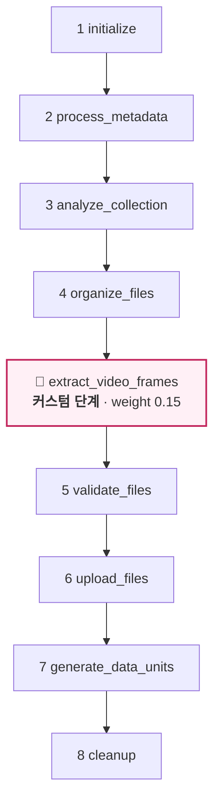
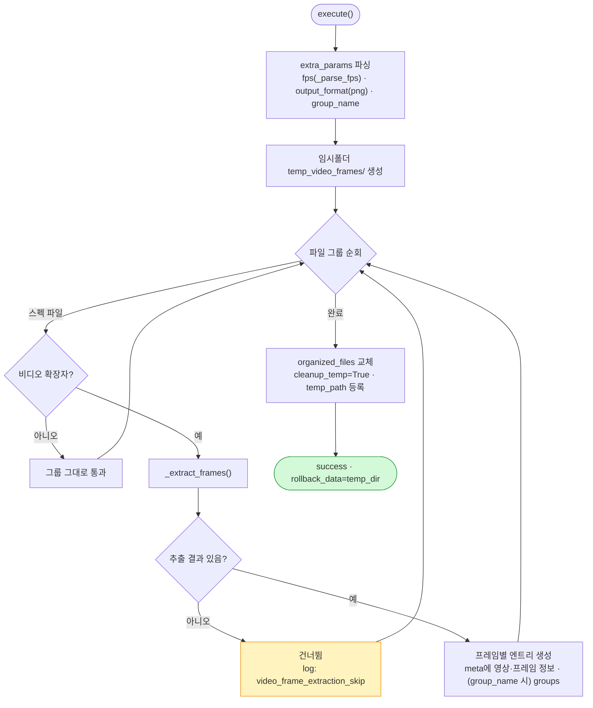
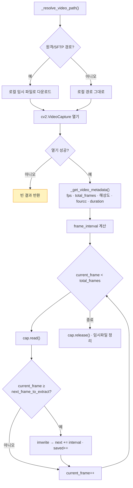

# video-to-image

비디오 파일에서 프레임을 이미지(PNG/JPG)로 추출하여 각 프레임을 데이터 유닛으로 업로드하는 업로드 플러그인. 초당 추출 프레임 수(FPS)를 지정할 수 있습니다.

---

## 1. 플러그인 식별 정보

| 항목 | 값 |
| --- | --- |
| 폴더명 / GitHub 저장소 | `extract-image-from-video` |
| 코드명 (`config.yaml` → `code`) | `extract-image-from-video` |
| 플러그인 이름 (`config.yaml` → `name`) | `video-to-image` |
| 패키지명 (`pyproject.toml` → `name`) | `video-to-image` |
| 버전 | `2.1.0` |
| 카테고리 | `upload` |
| 지원 데이터 타입 | `image` |
| upload 진입점 | `plugin.upload.UploadAction` |

---

## 2. 개요

업로드 직전에 **비디오를 프레임 단위 이미지로 추출**하여 프레임 1장 = 데이터 유닛 1개로 업로드합니다. `extracted_frame_per_second`로 초당 몇 장을 뽑을지 지정하며, 비워두면 모든 프레임을 추출합니다. 프레임 추출은 **OpenCV(cv2)** 를 사용하고, 원격/SFTP 경로는 로컬 임시 파일로 내려받아 처리합니다.

### 입/출력 스펙

| 구분 | 내용 |
| --- | --- |
| 대상 확장자 | `.mp4`, `.avi`, `.mov`, `.mkv`, `.wmv`, `.flv`, `.webm` |
| 출력 형식 | `png`(기본) 또는 `jpg` |
| 프레임 파일명 | `{원본stem}_{프레임번호:06d}.{ext}` |

### 프레임 간격 계산

```
extracted_fps 지정  →  frame_interval = video_fps / extracted_fps
미지정(전체 추출)   →  frame_interval = 1
```

---

## 3. 파라미터 (UI 스키마)

| 이름 | 형태 | 설명 | 기본값 |
| --- | --- | --- | --- |
| `extracted_frame_per_second` | text | 초당 추출 프레임 수. 비우면 전체 프레임 | (전체) |
| `output_format` | select | 출력 이미지 형식 (`png` / `jpg`) | `png` |
| `group_name` | text | 데이터 유닛에 부여할 묶음 이름 | (없음) |

---

## 4. 전체 업로드 워크플로우

`organize_files` **직후**에 `ExtractVideoFramesStep`(weight 0.15)을 삽입합니다.



---

## 5. `ExtractVideoFramesStep` 상세 로직

**스킵 판정**: `organized_files`에 지원 비디오 파일이 하나도 없으면 스킵.



### 프레임 추출 (`_extract_frames`)



- 100장마다 진행률 로그(`video_frame_extraction_progress`).
- **롤백**: 임시 디렉터리(`temp_video_frames`) 삭제.

---

## 6. 생성되는 메타데이터 (프레임별)

| 키 | 설명 |
| --- | --- |
| `origin_file_name` / `origin_file_format` | 원본 비디오 정보 |
| `fps` / `resolution` / `width` / `height` | 영상 속성 |
| `total_frames` / `duration` / `fourcc` | 영상 속성 |
| `frame_count` / `frame_index` | 추출된 프레임 수 / 현재 프레임(1부터) |
| `extracted_fps` | 지정 FPS 또는 `all` |
| `output_format` | 출력 형식 |
| `groups` | `group_name` 지정 시 (선택) |

---

## 7. 의존성

- `synapse-sdk`
- `opencv-python-headless`
- `numpy<2.1`

---

## 8. 설치 / 실행 / 배포

```bash
uv sync
synapse run upload
synapse plugin publish
```
